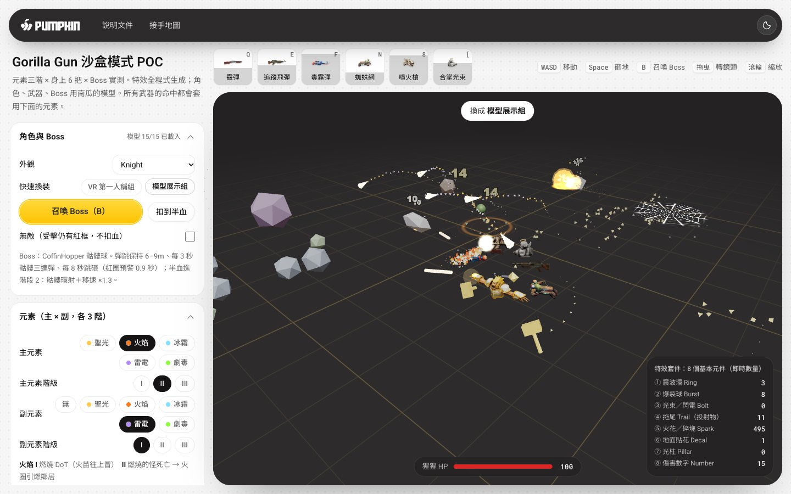
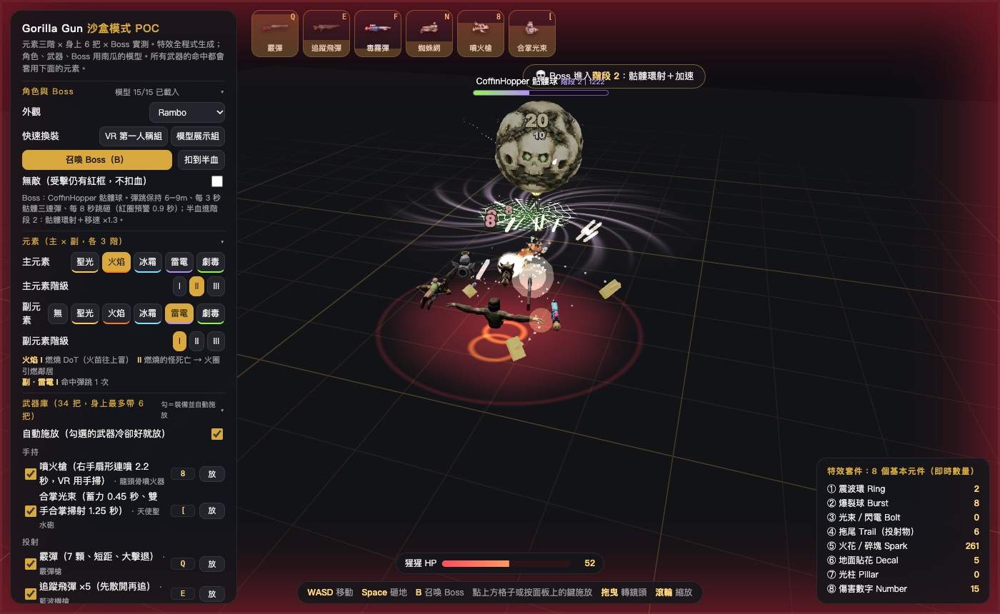
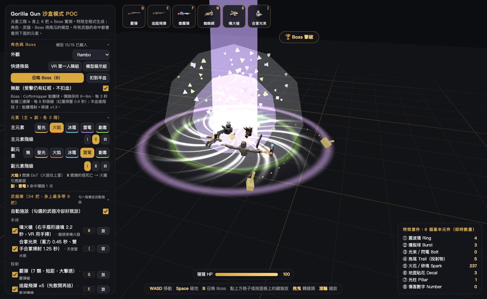
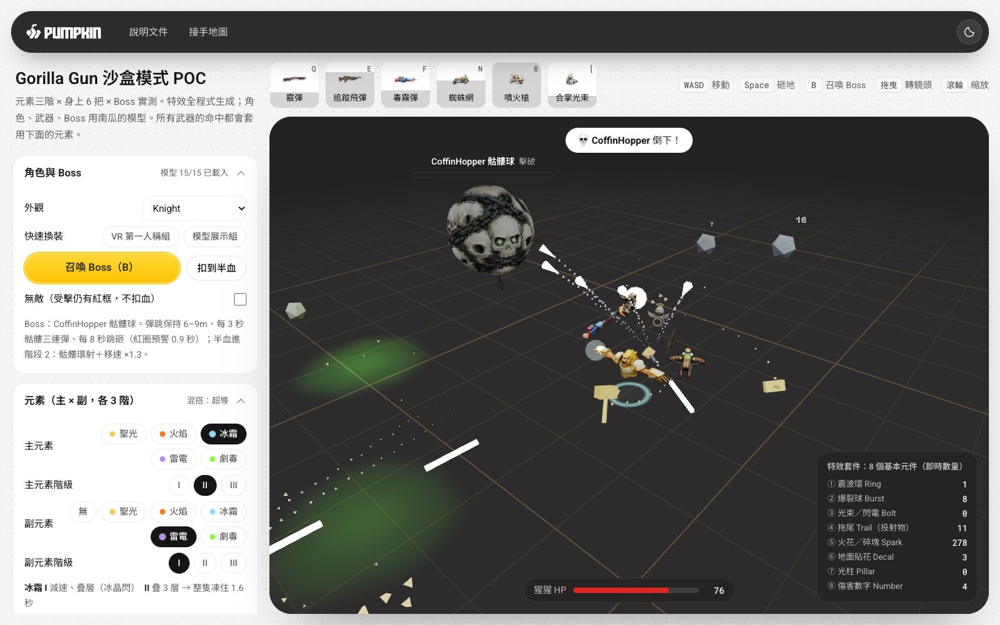
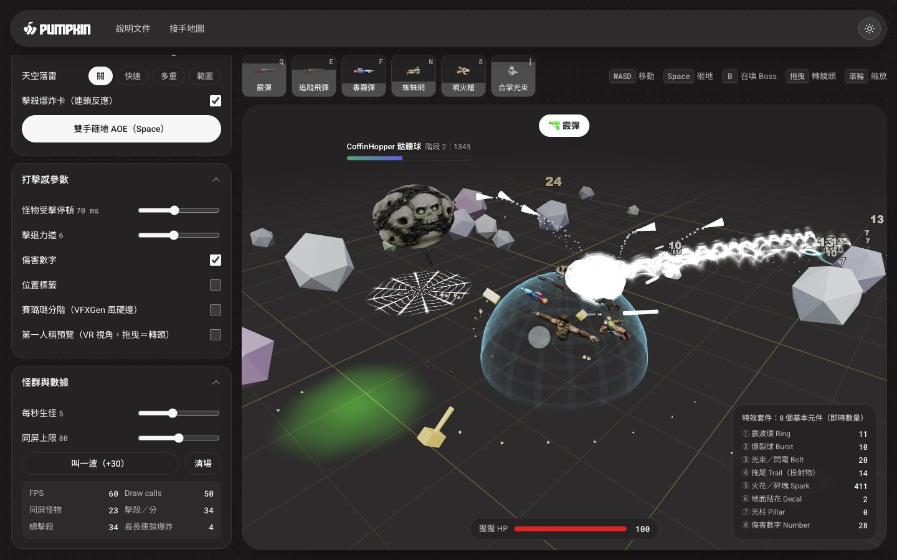
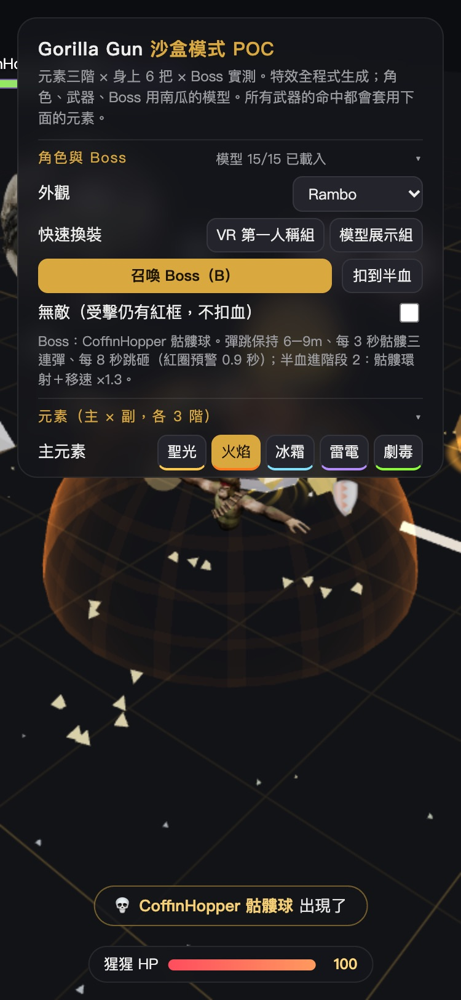
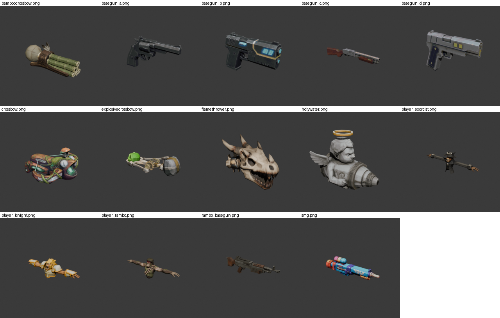

# Gorilla Gun 沙盒模式 POC

**元素三階 × 身上 6 把 × Boss 實測。**

猩猩背後漂著 6 把南瓜做的武器模型，34 把技能 × 5 元素 × 3 階 × 混搭規則全部能玩，再加一隻有骨架動畫的 Boss「CoffinHopper 骷髏球」來實測打擊感。

  

[線上試玩](https://terry12260201.github.io/gorilla-gun-sandbox-poc/) · [接手地圖 HANDOFF](HANDOFF.md) · [操作](#操作) · [元素表](#元素5-種--3-階主--副混搭) · [武器↔模型](#武器庫34-把身上帶-6-把-對應模型) · [Boss 規格](#bosscoffinhopper-骷髏球規格)



| Boss 跳砸紅圈預警 | Boss 死亡大爆炸 |
|---|---|
|  |  |

## 先開起來

| 想做什麼 | 怎麼做 |
|---|---|
| 線上玩 | 打開 <https://terry12260201.github.io/gorilla-gun-sandbox-poc/> |
| 本機玩 | 下載整個 repo，雙擊 `index.html`（file:// 直開即可，需連網載入 Three.js CDN） |
| 接手開發 | 先讀 [`HANDOFF.md`](HANDOFF.md) |

## 畫面怎麼看

一張紙上放著三樣東西，各做自己的事。

| 區塊 | 看起來 | 做什麼 |
|---|---|---|
| 左側面板 | 淺灰點格紙＋白卡（18px 圓角） | 所有設定：角色、元素、武器庫、打擊感、怪群 |
| 上方 6 格 | 6 張白色小卡 | 身上帶的 6 把武器；點格子施放，灰色遮罩由下往上＝冷卻中 |
| 舞台 | 深炭圓角區塊（32px 圓角） | 3D 遊戲畫面；Boss 血條、玩家 HP、特效計數、提示都疊在舞台上 |

右上角的月亮／太陽切換淺色與深色，下次打開會記住。滑鼠在空白處移動，紙上的小點會往游標靠；停在按鈕旁，小點沿按鈕邊緣收攏。



| 深色模式 | 手機 375px |
|---|---|
|  |  |

## 操作

| 鍵／操作 | 功能 |
|---|---|
| WASD／方向鍵 | 移動猩猩 |
| Space | 雙手砸地 AOE |
| **B** | **召喚 Boss**（面板的金色按鈕也可以） |
| 武器各自的鍵（見下表） | 手動施放；被動類（小幫手、聖光環）＝開關 |
| 上方 6 格 | 點格子施放；格子底部灰色遮罩＝冷卻中；格子裡是武器模型縮圖 |
| 面板勾選 | 勾＝裝備（最多 6 把）並自動施放 |
| 面板「外觀」 | 程式生成猩猩／Rambo／Knight／Exorcist（預設 Rambo） |
| 面板「快速換裝」 | VR 第一人稱組（原型預設）／模型展示組（6 把都有 GLB） |
| 面板「扣到半血」 | 測試用：把 Boss 直接打到 49%，進階段 2 |
| 面板「無敵」 | 受擊仍有紅框與數字，但不扣血 |
| 打擊感參數 → 第一人稱預覽 | 鏡頭放在猩猩頭上，看武器漂在身邊的 VR 感 |
| 拖曳／滾輪 | 轉鏡頭／縮放 |
| 右上角月亮／太陽 | 切換淺色／深色介面（舞台維持深炭） |

> **改鍵**：原本「陷阱」用 B，為了讓 B 給 Boss，陷阱改成 **1**。

## 元素：5 種 × 3 階，主 × 副混搭

**每一階都改「行為」，不是改數字。** 所有武器的命中都走同一個入口（`enemies.hit` → `applyElements`），所以 34 把武器 × 5 元素 × 3 階全部自動成立，Boss 也一樣吃。

| 元素 | I | II | III |
|---|---|---|---|
| 聖光 | 命中落下小光柱、+30% 傷害 | 擊殺 → 審判光柱 AOE | 聖印：同一隻被打 3 下 → 十字光爆 |
| 火焰 | 燃燒 DoT（火苗往上冒） | 燃燒的怪死亡 → 火圈引燃鄰居 | 死亡留下火海 3 秒 |
| 冰霜 | 減速、疊層（冰晶閃） | 疊 3 層 → 整隻凍住 1.6 秒 | 打凍住的怪 → 碎裂＋冰爆擴散 |
| 雷電 | 命中彈跳 1 次 | 彈跳 3 次 | 被電的怪變導體：留下 2 秒靜電場 |
| 劇毒 | 中毒疊層 DoT（綠泡） | 死亡留下毒池 | 毒池生出毒雲，自己飄去找怪 |

**混搭規則**：副元素只送它的階級行為 ＋ 一條「招牌規則」，不是一套新元素、不移除原屬性。玩家一眼看得出是哪兩個混的，美術只要維護 5 套。

| 混搭 | 招牌規則 |
|---|---|
| 毒＋雷＝輻射 | 電弧經過的怪都中毒 |
| 火＋毒＝毒氣爆 | 燃燒中的怪踩進毒池 → 毒池爆炸 |
| 火＋冰＝蒸氣熱震 | 同一隻又燒又凍 → 額外爆發、周圍減速 |
| 冰＋雷＝超導 | 電弧經過冰凍／減速的怪不衰減、多跳 2 次 |
| 聖光＋X＝擴散 | 光柱把 X 的 I 階傳給周圍 1.3m 的怪 |

面板上的元素按鈕前面有一顆小色點，就是該元素在遊戲裡的主色；選中的按鈕是墨底白字。

## 武器庫（34 把，身上帶 6 把）＋ 對應模型

身上 6 把會在猩猩背後排成一圈、各自瞄準最近的怪；施放時有後座力（往後退＋槍口上揚）和槍口發光 pop。有模型的投射類技能會**從槍口射出**。

對照表在 `index.html` 的 `WEAPON_MODEL` 常數。貼合度：**貼合**＝語意直接對上；**借用**＝沒有專屬模型，先借最接近的一把當「發射器」；**程式生成**＝保留原本造型（身上槽位顯示 emoji）。

| 類型 | 武器 | 鍵 | 一句話 | 對應模型 | 貼合度 |
|---|---|---|---|---|---|
| 手持 | 噴火槍 | 8 | 右手扇形連噴 2.2 秒，VR 用手掃 | flamethrower 龍頭骨噴火器 | 貼合 |
| 手持 | 合掌光束 | [ | 蓄力 0.45 秒、掃射 1.25 秒 | holywater 天使聖水砲 | 貼合 |
| 投射 | 霰彈 | Q | 7 顆、短距、大擊退 | basegun_c 霰彈槍 | 貼合 |
| 投射 | 追蹤飛彈 ×5 | E | 先扇形散開 0.25 秒再追 | rambo_basegun 藍波機槍 | 貼合 |
| 投射 | 炸彈 | R | 拋物線、會彈跳、1.1 秒引爆 | explosivecrossbow 骨頭爆裂弩 | 貼合 |
| 投射 | 毒霧彈 | F | 落地成 5 秒毒池＋綠霧 | smg 彩色水槍 | 貼合 |
| 投射 | 大火球 | U | 慢、大、炸 3.2m 一圈並引燃 | flamethrower 龍頭骨噴火器 | 貼合 |
| 投射 | 冰封球 | I | 邊飛邊灑冰箭、終點 16 發放射 | basegun_b 科幻手槍 | 借用 |
| 投射 | 光標槍 | O | 命中後電弧擴散到 7m 內最多 10 隻 | bamboocrossbow 竹管連弩 | 貼合 |
| 近身 | 爪擊 | C | 三道斜斬光痕、扇形判定 | — | 程式生成 |
| 近身 | 旋風衝鋒 | V | 衝 0.95 秒、六片刀刃環繞 | — | 程式生成 |
| 近身 | 迴旋鐮刀 | T | 飛出 6.5m 再 S 形回來 | — | 程式生成 |
| 近身 | 天降大拳頭 | G | 砸最密的一群 | — | 程式生成 |
| 近身 | 迴旋鋸刃 | H | 在怪之間彈 6 下再飛回 | — | 程式生成 |
| 近身 | 大型手裡劍 | J | 穿透一整排、去回各切一次 | — | 程式生成 |
| 場地 | 地刺區 | X | 14 根刺冒 3.5 秒 | — | 程式生成 |
| 場地 | 裂地 | Z | 往前竄 10 段裂縫 | — | 程式生成 |
| 場地 | 陷阱 | **1** | 怪踩到才炸 | explosivecrossbow 骨頭爆裂弩 | 借用 |
| 場地 | 蜘蛛網／冰網 | N | 定身 4 秒 | crossbow 藤蔓生物弩 | 貼合 |
| 場地 | 隕石雨 | L | 先預警環、8 顆依序砸 | — | 程式生成 |
| 場地 | 黑洞 | 0 | 吸 2.6 秒再爆開 | basegun_b 科幻手槍 | 借用 |
| 召喚 | 三頭火龍 | 4 | 定點 9 秒各自鎖怪 | — | 程式生成 |
| 召喚 | 哨塔 | 5 | 定點點射 | basegun_a 左輪 | 借用 |
| 召喚 | 龍捲風 | 6 | 遊走、吸怪、頂飛 | — | 程式生成 |
| 召喚 | 小幫手 | 7 | 自走撞怪爆（開關） | — | 程式生成 |
| 召喚 | 地獄手 | K | 5 隻手抓住拖住、最後一起捏 | — | 程式生成 |
| 召喚 | 雷暴雲 | - | 頭上烏雲跟 10 秒、隨機劈雷 | basegun_d 1911 手槍 | 借用 |
| 防護／領域 | 防護罩 | 9 | 半球罩 6 秒，吸收 5 下後爆開（也擋 Boss 骷髏彈） | — | 程式生成 |
| 防護／領域 | 冰牆 | = | 前方 7 根冰柱擋 4 秒 | — | 程式生成 |
| 防護／領域 | 時緩領域 | ] | 3.5m 內怪物慢 85%，5 秒 | — | 程式生成 |
| 防護／領域 | 聖光環 | ; | 被動：每秒一圈 3.2m 光環 | holywater 天使聖水砲 | 貼合 |
| 胡鬧 | 香蕉迴力鏢 | P | 踩到滑倒、轉圈圈 | — | 程式生成 |
| 胡鬧 | 椰子雨 | M | 10 顆亂彈 4.5 秒 | — | 程式生成 |
| 胡鬧 | 捶胸怒吼 | Y | 全場 7m 暈眩、定身 1.8 秒 | — | 程式生成 |

11 把模型全部都有用到；15 把技能有模型、19 把保留程式生成。

## Boss 2：SNAIL 毒蝸牛（2026-10-09 新增）

面板「角色與 Boss」的 Boss 下拉可選 **💀 CoffinHopper 骷髏球** 或 **🐌 SNAIL 毒蝸牛**，B 鍵召喚目前選的那隻。網址 `?boss=snail&summon=1` 開頁直接召喚。
模型：南瓜雲端 `3D Model/Boss_01/SK_Snail_Lowpoly`（`assets/boss/snail.glb`，4.6 m 高、12 支原生動畫，貼圖已內嵌）。

| 項目 | 規格 |
|---|---|
| 移動 | 慢慢爬（Walk），保持 4.5–7 m，會側移；腳下冒綠色黏液泡泡 |
| 吐毒（每 4 秒） | 播 SkillAttack，吐 3 團綠色毒液（有重力、輕微追蹤），**落地或命中變毒池 4 秒**，站在裡面每 0.5 秒扣 3 |
| 衝撞（每 10 秒） | 播 AttackStart，地上一排 6 個綠圈標出路線 0.9 秒 → 播 AttackMove 直線衝 0.9 秒，途中撞到扣 26，終點地裂 |
| 階段 2（HP < 50%） | 毒液環射 10 發（每 6 秒）＋移速 ×1.35，整隻偏綠 |
| 死亡 | 播 Death → 大爆炸（綠＋金）＋金色碎塊飛向玩家 |
| HP | 600（brute 12 × 50） |

程式上兩隻 Boss 共用同一套狀態機（`updateBoss`），差別全部寫在 `BOSSES` 設定表：`clips`（哪個動作用哪支動畫）、`hop`（彈跳或等速爬）、`slam.charge`（跳砸或衝撞）、`toxic`（骷髏彈或毒液彈＋毒池）、`col/col2`（配色）。要加第三隻 Boss 就再加一筆。

## Boss：CoffinHopper 骷髏球（規格）

主專案照同一份規格做。所有數字集中在 `index.html` 的 `BOSS` 常數。

| 項目 | 規格 |
|---|---|
| 體型 | 約猩猩 2.5 倍（模型原高 ~0.96 → ×4.2 ≈ 4m） |
| HP | 一般 brute（12）× 25 ＝ 300；頭上血條（顯示值 ×10，跟傷害數字同單位） |
| 移動 | 彈跳前進（播 Walk，一個循環＝一跳，空中才往前衝），與玩家保持 **6–9m**；在範圍內會左右繞圈 |
| 攻擊 1：骷髏三連彈 | 每 **3 秒**，扇形 3 顆紫綠色骷髏彈（速度 6 m/s、輕微追蹤），播 Attack；每顆 8 傷害 |
| 攻擊 2：跳砸 | 每 **8 秒**，玩家腳下出現紅色預警圈 **0.9 秒**（圈在「當時」玩家位置）→ Boss 跳 0.6 秒落地 → 震波 AOE 半徑 **4m**（震波環＋地裂），20 傷害 |
| 階段 2（HP < 50%） | 切換瞬間一次大震波（半徑 8m、12 傷害）；之後每 5 秒「骷髏環射」**12 發**放射；移動速度 **×1.3**；整體偏紫 |
| 被打 | 播 Hit（只在移動狀態、間隔 ≥ 1.2 秒，不打斷攻擊）；閃白＋微脹 |
| 元素 | 走同一個 `enemies.hit` 入口，燃燒／中毒／減速／冰凍／導體／聖印都會套上（模型會染對應顏色） |
| Boss 減免 | 不吃 hitstop、擊退、頂飛；黑洞／龍捲風拉不動；冰凍時間減半；被定身只減速 70%；冰碎裂固定 8 傷害（不吃 60% 最大 HP） |
| 死亡 | 播 Death（三顆骷髏噴出）→ 播完大爆炸＋大量金色碎塊飛向玩家 |

**玩家受擊**：原型本來沒有玩家 HP，這版加了簡單 HP 條（100）＋受擊紅框＋紅色傷害數字＋輕微被推開；HP 歸零 2 秒後復活。不震鏡頭（VR 舒適度）。只有 Boss 的攻擊會傷玩家，一般怪維持原型行為不攻擊。

## 介面設計：南瓜墨金 1.2

只換視覺層，遊戲邏輯與數值沒動。

| 規則 | 這裡怎麼用 |
|---|---|
| 紙 `#F5F5F5`＋互動點格 | 頁面底；`vendor/ink-gold/ink-gold-ui.js` 畫磁吸點格，手機與「減少動態」時保留靜態點 |
| 白卡 `#FFFFFF`、18px 圓角、1px 墨 8% 邊線 | 面板每一段（`<details>`）、上方 6 格 |
| 墨 `#161415` 一色分層 | 標題 100%、說明 65%、必要小字 64%；選中的分段按鈕＝墨底白字 |
| 金 `#FDC302 → #FFD83A` 只一個 | 全頁只有「召喚 Boss（B）」是金色；砸地按鈕降為墨色 |
| 深炭舞台 `#2D2B2C → #242223`、32px 圓角 | 3D 畫面底色、地板、霧都換成深炭；HUD 用炭色半透明＋白字 |
| 字體 | Roboto（英數）＋ Noto Sans TC（中文），離線時退回蘋方／微軟正黑；數字用 Roboto Mono |
| 深淺切換 | 導覽列右側；記在 `localStorage.igTheme` |

CSS 套件原樣內嵌在 `index.html` 的 `/* ink-gold kit:start */ … /* ink-gold kit:end */` 之間，本專案自己的版面規則接在後面，顏色一律用 `--ig-*` token。

## 檔案結構

```
index.html               整個原型（HTML＋CSS＋JS；內嵌墨金 CSS 套件）
models.js                自動產生：assets/**/*.glb 轉 base64（讓 file:// 也能載入），不要手改
tools/build-models.mjs   產生 models.js 的小工具（Node 18+，無外部依賴）
vendor/ink-gold/
  ink-gold-ui.js         墨金互動點格＋深淺切換（從設計系統原樣複製）
  pumpkin-logo-black.svg 南瓜正式 Logo（深色導覽以 CSS 反相成白色）
assets/
  weapons/*.glb          11 把武器（槍管朝 +X）
  hero/player_*.glb      3 個猩猩玩家上半身（T-pose）
  boss/coffin_hopper.glb Boss（骨架＋Idle/Walk/Attack/Hit/Death，原地播放）
  models-sheet.png       所有模型縮圖一覽
docs/screenshots/        驗證截圖
HANDOFF.md               給下一位開發者／AI 的架構地圖
.nojekyll                讓 GitHub Pages 原樣提供檔案
```

## 怎麼擴充（step-by-step）

### 加一把新武器

1. 在 `index.html` 寫一個 `castXxx()`。命中一律呼叫 `enemies.hit(e, 傷害, 方向, 顏色, { knock, fxScale, lift })`，元素、傷害數字、打擊感、Boss 都會自動套上。
2. 要從槍口射出：起點用 `muzzle('你的id')`（沒裝在身上時會自動退回手的位置）。
3. 如果有持續狀態，寫 `updateXxx(dt)` 並加進 `updateV4()`（或 `step()` 裡的更新清單）。
4. 在 `WEAPONS` 陣列加一行：`{ id, icon, short, name, group, key: 'KeyX', k: 'X', cd, cast: castXxx }`。注意按鍵不要撞到現有的（B 給 Boss、WASD 給移動）。
5. 在 `WEAPON_MODEL` 加 `xxx: ['模型key', '貼合']`，不加就是程式生成（槽位顯示 emoji）。
6. 重新整理頁面，勾選裝備測試。

### 加一個新元素

1. `ELEM` 加一筆：`{ name, core, main, dark, tier: ['I 階說明', 'II 階說明', 'III 階說明'] }`（三個色票）。
2. `applyOne()` 的 `switch` 加 `case '新元素':`，寫三階行為（只改行為、不只改數字）。
3. 死亡行為寫在 `onDeathElements()`；持續狀態（DoT 等）寫在 `updateStatus()`，顏色加進 `statusColor()`／`tintOf()`／`bossSync()`。
4. 要混搭規則就在 `COMPOUND` 加 `'a+b'`（字母排序）並在對應位置用 `hasCompound('a+b')` 判斷。
5. 面板按鈕會自動從 `ELEM` 產生（按鈕前的小色點取 `main` 色）。

### 換模型／加模型

1. 把 `.glb` 放進 `assets/weapons/`（武器槍管請朝 **+X**，尺寸不拘，程式會自動置中並縮放到 0.62–1.25m）。
2. 在 repo 根目錄執行：`node tools/build-models.mjs`（會重寫 `models.js`）。
3. 新武器模型：在 `MODEL_INFO` 加中文名，再到 `WEAPON_MODEL` 指給技能。
4. 英雄外觀：放 `assets/hero/xxx.glb` → `HERO_MODELS` 加一筆 → 面板 `<select id="look">` 加 `<option>`；大小用 `HERO_FIT` 調。
5. 重新整理頁面，面板「角色與 Boss」右邊會顯示「模型 N/N 已載入」。

### 換 Boss

1. 新 Boss 的 `.glb` 放 `assets/boss/`，需含骨架與 `Idle / Walk / Attack / Hit / Death` 五個 clip（名稱一樣，原地播放）。
2. 跑 `node tools/build-models.mjs`。
3. 改 `BOSS.model` 指向新 key（例：`'boss/new_boss'`），用 `BOSS.scale` 調大小、`BOSS.size` 調命中半徑。
4. 招式節奏、傷害、距離都在 `BOSS` 常數；招式本身在 `bossTriShot()`、`bossRingShot()`、`bossShock()`；狀態機在 `updateBoss()`。

### 改介面樣式

1. 顏色、圓角、字體先找 `--ig-*` token（內嵌套件段），不要另外寫色碼。
2. 本專案版面（面板寬、舞台、HUD、手機排法）在套件段後面的「Gorilla Gun 沙盒 POC · 工作區版面」。
3. 金色維持只有一顆主按鈕；新增按鈕預設白底，次要主動作用 `class="ink"`。
4. 設計系統更新時，把新版 `ink-gold.css` 整段貼回兩個 `kit` 標記之間，`ink-gold-ui.js` 覆蓋 `vendor/ink-gold/`。

## 測試法：`window.step(dt)`

所有時間（特效、計時器、Boss 動畫 `AnimationMixer`）都由 `step(dt)` 推進，不讀系統時間，所以可以在 console 手動快轉，結果可重現：

```js
summonBoss();                                   // 召喚 Boss
for (let i = 0; i < 90; i++) step(1 / 30);      // 推 3 秒 → 應該看到骷髏三連彈
boss.state                                      // 'move' / 'attack' / 'tele' / 'jump' / 'land' / 'dying'
boss.e.hp = boss.e.maxhp * .49;                 // 進階段 2
W.god = true;                                   // 無敵
```

> **自動化截圖**：背景分頁的瀏覽器會凍住 `requestAnimationFrame`，一律用 `step()` 推進，截圖連拍兩張取第二張。

## 已知限制

- **這是視覺規格樣板，不直接移植 UE5。** 能搬的是：時間參數、半徑／傷害／擊退表、元素三階規則、5 條混搭規則、Boss 規格表、8 個特效元件的 fragment 數學、色票。Three.js 程式碼本身不能搬。
- 英雄模型是 T-pose 上半身，沒有動作；換外觀時手的位置是估的（`HERO_FIT.hand`）。
- 「借用」的模型只是暫代，之後有專屬模型改 `WEAPON_MODEL` 即可；近身／召喚／場地類多數保留程式生成。
- 武器縮放規則是統一公式（最長邊 ×1.9，夾在 0.62–1.25m），個別模型若要微調得另外加參數。
- 只能同時有 1 隻 Boss；一般怪不會攻擊玩家。
- 首次載入要下載 `models.js`（約 3 MB）與 Three.js CDN，離線無法開；離線時網頁字體退回系統字（蘋方／微軟正黑），外觀會略有差異。
- 第一人稱預覽時會隱藏英雄模型（T-pose 手臂會擋視線）。
- 手機與平板直式（≤900px）沒有鍵盤，特效計數面板與鍵位說明會收起；格子名稱太長時以「…」截斷，滑鼠停留可看全名。

## 移植到 UE5／Quest 的對照

| 這裡 | UE5 對應 | Quest 注意 |
|---|---|---|
| `Particles`（InstancedMesh、CPU 推進） | Niagara GPU Sprite／Mesh emitter，欄位一對一（pos/vel/life/size/color/grav/drag/target） | 粒子用 Masked 或 Opaque，少用半透明 |
| `AgedPool` 震波環／地裂／毒池／蜘蛛網（aAge＋fragment） | Niagara Mesh Renderer 掛 Plane，Dynamic Material Parameter 傳 Age；fragment 數學貼進 Material Custom 節點 | 比 Decal Actor 便宜，Quest 禁大量 Decal |
| `Bolts` ribbon | Niagara Ribbon Renderer＋Jitter Position 每 45 ms 重抖 | 核心 Additive、外暈 Translucent 低 alpha |
| `Bursts`／`Pillars` | Niagara Mesh＋Additive Unlit，Color × (1−Age)² | overdraw 是 Quest 殺手，光柱 ≤ 4 支 |
| 狀態欄位 burn／chill／frozen／poison／cond／mark | GAS GameplayEffect＋Tag | 狀態顏色用 Custom Primitive Data 一個 float4 |
| `applyElements` 單一入口 | 命中後統一呼叫一支套用元素的 Ability，讀 DataTable 的階級行為 | 武器都不用個別改 |
| 身上 6 槽位 `bodySlots` | 6 個 Socket／SceneComponent 掛在 Pawn 上，各自 LookAt 目標 | 槍模型共用材質實例 |
| Boss `updateBoss` 狀態機 | Behavior Tree／State Tree；Walk/Attack/Hit/Death 走 AnimMontage | 位移交給程式（Root Motion 關） |
| hitstop／flash／squash | Custom Time Dilation 只套被打的 Pawn | 不動 Global Time Dilation、不震鏡頭 |

## 模型縮圖一覽



---

Gorilla Gun 沙盒模式 POC · 南瓜虛擬科技 · 介面：南瓜墨金美學 1.2
